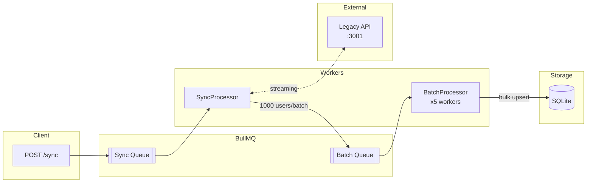

# User Sync Service - Teste Técnico


Serviço de integração que sincroniza dados de um sistema legado instável, mantém base própria e disponibiliza endpoints REST.

## Sobre o Projeto

Este serviço foi desenvolvido como solução para o desafio de integração com um sistema legado que apresenta:

- **40% de taxa de erro** (20% HTTP 500 + 20% HTTP 429)
- **20% de dados corrompidos** (JSON inválido)
- **Duplicatas** por `user_name`
- **Soft deletes** misturados com registros ativos

O serviço implementa padrões de resiliência para lidar com essas instabilidades e processa **~1 milhão de usuários em ~18-20 minutos**.

> **📦 Projeto Self-Contained:** A API legada (mock) está incluída na pasta `docker/legacy-api/` com ~1M de usuários. Execute `make dev` para subir tudo automaticamente.

A aplicação é **facilmente deployável em AWS** utilizando serviços gerenciados como ECS Fargate, ElastiCache (Redis) e RDS PostgreSQL. Veja a arquitetura proposta em [docs/AWS_ARCHITECTURE.md](docs/AWS_ARCHITECTURE.md).

## Stack Tecnológica

| Tecnologia           | Justificativa                                                    |
| -------------------- | ---------------------------------------------------------------- |
| **NestJS + Fastify** | Framework enterprise-grade, Fastify 2-3x mais rápido que Express |
| **SQLite + TypeORM** | Zero configuração, banco em arquivo único                        |
| **BullMQ + Redis**   | Processamento assíncrono com retry automático                    |
| **Swagger**          | Documentação interativa da API                                   |

## Requisitos

- **Node.js 18+**
- **Docker** e **Docker Compose**

---

## Como Executar

### Opção 1: Docker Compose (Recomendado)

Sobe todos os serviços (API, Redis e Legacy API) com um comando:

```bash
# Usando Make
make dev

# Ou diretamente com docker-compose
docker-compose -f docker/docker-compose.dev.yml up --build
```

### Opção 2: Desenvolvimento Local

```bash
# 1. Suba o Redis
docker run -d --name redis-local -p 6379:6379 redis:7-alpine

# 2. Instale dependências e rode o serviço
npm install
cp .env.example .env
npm run start:dev
```

> **Nota:** O serviço requer a API legada rodando na porta 3001. Ela está incluída em `docker/legacy-api/` ou configure `LEGACY_API_URL` e `LEGACY_API_KEY` no `.env` para apontar para outra instância.

### Opção 3: Build de Produção

```bash
# Build da imagem
docker build -t user-sync-service -f docker/Dockerfile .

# Executar (requer Redis rodando)
docker run -m 128m -p 3000:3000 \
  -e REDIS_HOST=host.docker.internal \
  -e REDIS_PORT=6379 \
  -e LEGACY_API_URL=http://host.docker.internal:3001 \
  -e LEGACY_API_KEY=your-api-key \
  user-sync-service
```

---

## URLs de Acesso

| URL                            | Descrição                         |
| ------------------------------ | --------------------------------- |
| http://localhost:3000          | API REST                          |
| http://localhost:3000/api/docs | Swagger (documentação interativa) |
| http://localhost:3001          | API Legada (mock para testes)     |

---

## Endpoints da API

### Usuários (`/users`)

| Método   | Rota                | Descrição                                              |
| -------- | ------------------- | ------------------------------------------------------ |
| `GET`    | `/users`            | Lista usuários com paginação (`?page=1&limit=10`)      |
| `GET`    | `/users/:user_name` | Busca por userName                                     |
| `GET`    | `/users/export/csv` | Exporta CSV com filtros (`?created_from=&created_to=`) |
| `POST`   | `/users`            | Cria usuário                                           |
| `PUT`    | `/users/:id`        | Atualiza usuário                                       |
| `DELETE` | `/users/:id`        | Remove usuário (soft delete)                           |

### Sincronização (`/sync`)

| Método | Rota            | Descrição                                |
| ------ | --------------- | ---------------------------------------- |
| `POST` | `/sync`         | Dispara sincronização com sistema legado |
| `GET`  | `/sync/status`  | Status da última sync (com métricas)     |
| `GET`  | `/sync/history` | Histórico de sincronizações (`?limit=N`) |
| `POST` | `/sync/reset`   | Reseta sync travada                      |

> **Sincronização Automática:** A cada 6 horas, o serviço executa automaticamente uma sincronização via `@Cron(EVERY_6_HOURS)`.

#### Response: `GET /sync/status`

```json
{
  "id": 1,
  "status": "COMPLETED",
  "startedAt": "2025-01-15T10:00:00.000Z",
  "finishedAt": "2025-01-15T10:20:00.000Z",
  "totalProcessed": 1000000,
  "errorMessage": null,
  "durationMs": 1200000,
  "durationFormatted": "20m 0s",
  "recordsPerSecond": 833.33,
  "estimatedTimeRemaining": null,
  "progressPercent": 100,
  "batchSize": 1000,
  "workerConcurrency": 5
}
```

### Health Check (`/health`)

| Método | Rota      | Descrição                            |
| ------ | --------- | ------------------------------------ |
| `GET`  | `/health` | Liveness probe (para load balancers) |

**Status possíveis:** `healthy`, `degraded`, `unhealthy` (HTTP 503)

---

## Variáveis de Ambiente

| Variável                       | Obrigatório | Default                  | Descrição                                  |
| ------------------------------ | ----------- | ------------------------ | ------------------------------------------ |
| `NODE_ENV`                     | Não         | `development`            | Ambiente (development, production, test)   |
| `PORT`                         | Não         | `3000`                   | Porta do servidor                          |
| `DATABASE_PATH`                | Não         | `./data/database.sqlite` | Caminho do SQLite                          |
| `TYPEORM_LOGGING`              | Não         | `false`                  | Habilita logs SQL                          |
| `REDIS_HOST`                   | **Sim**     | -                        | Host do Redis                              |
| `REDIS_PORT`                   | **Sim**     | -                        | Porta do Redis                             |
| `LEGACY_API_URL`               | **Sim**     | -                        | URL da API legada                          |
| `LEGACY_API_KEY`               | **Sim**     | -                        | Chave de autenticação                      |
| `SYNC_BATCH_SIZE`              | Não         | `1000`                   | Usuários por batch                         |
| `SYNC_WORKER_CONCURRENCY`      | Não         | `1`                      | Workers paralelos (sync queue)             |
| `SYNC_BATCH_CONCURRENCY`       | Não         | `5`                      | Workers paralelos (batch queue)            |
| `SYNC_STALE_THRESHOLD_MINUTES` | Não         | `30`                     | Timeout para sync travada (min)            |
| `SYNC_ESTIMATED_TOTAL_RECORDS` | Não         | `1000000`                | Estimativa de registros no legado          |
| `RATE_LIMIT_TTL`               | Não         | `60`                     | Janela de rate limit (segundos)\*          |
| `RATE_LIMIT_MAX`               | Não         | `100`                    | Máximo de requests por janela\*            |
| `LOG_LEVEL`                    | Não         | `info`                   | Nível de log (trace/debug/info/warn/error) |
| `SERVICE_NAME`                 | Não         | `user-sync-service`      | Nome do serviço nos logs                   |

> \* **Rate Limiting:** O throttling está configurado na aplicação. Para proteger rotas, aplique `@UseGuards(ThrottlerGuard)` nos controllers desejados ou configure globalmente com `APP_GUARD`.

Exemplo completo em [.env.example](.env.example).

---

## Fluxo de Sincronização



<details>
<summary>Diagrama ASCII (fallback)</summary>

```
┌─────────────┐     ┌─────────────┐     ┌─────────────────┐
│ POST /sync  │────▶│ Sync Queue  │────▶│  SyncProcessor  │
│ (Controller)│     │  (BullMQ)   │     │  (Orquestrador) │
└─────────────┘     └─────────────┘     └────────┬────────┘
                                                 │ streaming
                                                 ▼
┌─────────────┐                        ┌─────────────────┐
│ Legacy API  │◀──────streaming────────│ LegacyApiClient │
│  (:3001)    │                        │  (axios stream) │
└─────────────┘                        └────────┬────────┘
                                                │ batch (1000 users)
                                                ▼
                                       ┌─────────────────┐
                                       │  Batch Queue    │
                                       │    (BullMQ)     │
                                       └────────┬────────┘
                                                │ x5 parallel workers
                                                ▼
                                       ┌─────────────────┐
                                       │ BatchProcessor  │
                                       │  (bulk upsert)  │
                                       └────────┬────────┘
                                                │
                                                ▼
                                       ┌─────────────────┐
                                       │    SQLite DB    │
                                       └─────────────────┘
```

</details>

---

## Arquitetura do Projeto

```
.
├── src/                  # Código principal do serviço
│   ├── domain/           # Núcleo isolado (Clean Architecture)
│   │   ├── models/       # Modelos puros (User, SyncLog) - sem ORM
│   │   ├── repositories/ # Interfaces de persistência (contratos)
│   │   └── services/     # Interfaces de serviços externos (ILogger, ILegacyApiClient)
│   ├── application/      # Casos de uso
│   │   ├── services/     # UserService, SyncService, HealthService
│   │   └── dtos/         # Validação de entrada/saída
│   ├── infrastructure/   # Implementações concretas
│   │   ├── config/       # Validação de env vars
│   │   ├── database/     # Entidades ORM e Data Mappers
│   │   ├── legacy/       # Cliente da API legada (Axios)
│   │   ├── logger/       # LoggerService (implementa ILogger)
│   │   ├── queue/        # Processadores BullMQ
│   │   ├── repositories/ # Implementações TypeORM
│   │   └── resilience/   # Circuit breaker, retry
│   └── presentation/     # Camada HTTP
│       ├── controllers/  # REST endpoints
│       ├── filters/      # Tratamento de erros
│       └── interceptors/ # Logging de requests/responses
└── docker/               # Configurações Docker
    ├── Dockerfile        # Build de produção
    ├── docker-compose.dev.yml
    └── legacy-api/       # API legada mock (~1M usuários)
```

---

## Logging

O serviço usa o logger padrão do NestJS (`ConsoleLogger`) implementando a interface `ILogger` para inversão de dependência.

Um `LoggingInterceptor` global loga automaticamente todas as requests e responses:

```
[HTTP] Request  { method: 'POST', url: '/users', body: { userName: 'john', ... } }
[HTTP] Response { method: 'POST', url: '/users', statusCode: 201, duration: '15ms', body: {...} }
```

---

## Padrões de Resiliência

O serviço implementa múltiplos padrões para lidar com a instabilidade da API legada:

| Padrão                  | Implementação                        |
| ----------------------- | ------------------------------------ |
| **Retry com Backoff**   | 100ms → 500ms (max 10 tentativas)    |
| **Circuit Breaker**     | Abre após 10 falhas, recupera em 30s |
| **Parser Tolerante**    | Ignora JSON corrompido e continua    |
| **Retry Queue**         | Agenda retry em 10min se sync falhar |
| **Timeout de Sync**     | Marca como FAILED após 30min         |
| **Recovery no Startup** | Reseta syncs órfãs ao iniciar        |

---

## Performance

O sistema foi otimizado para processar grandes volumes:

| Métrica     | Valor                      |
| ----------- | -------------------------- |
| Throughput  | ~800-850 registros/segundo |
| 1M usuários | ~18-20 minutos             |
| Batch size  | 1000 usuários              |
| Retry delay | 100-500ms                  |

**Otimizações aplicadas:**

- Streaming HTTP (não carrega tudo em memória)
- Bulk Upsert com Raw SQL (`INSERT ... ON CONFLICT`)
- Non-blocking batch processing
- Deduplicação por `user_name` usando `legacy_created_at`

---

## Makefile

Comandos disponíveis para facilitar o desenvolvimento:

```bash
make dev         # Docker Compose com hot reload
make prod        # Roda build de produção com limite de 128MB
make stop        # Para containers
make logs        # Logs do container api
make clean       # Remove containers e dados
make build       # Build de produção
make test        # Roda testes
make lint        # Verifica código
make help        # Lista todos os comandos
```

---

## Scripts NPM

```bash
npm run start:dev    # Desenvolvimento com hot reload
npm run build        # Build de produção
npm run start:prod   # Executa build compilado
npm run lint         # Verifica e corrige código
npm run test         # Testes unitários
npm run test:cov     # Testes com coverage
npm run test:e2e     # Testes end-to-end
```

---

## Testando a API

### Sincronização

```bash
# Disparar sincronização
curl -X POST http://localhost:3000/sync

# Verificar status (inclui progresso e métricas)
curl http://localhost:3000/sync/status

# Histórico de sincronizações
curl http://localhost:3000/sync/history

# Resetar sync travada
curl -X POST http://localhost:3000/sync/reset
```

### Usuários (CRUD)

```bash
# Listar com paginação
curl "http://localhost:3000/users?page=1&limit=10"

# Buscar por username
curl http://localhost:3000/users/john_doe

# Criar usuário
curl -X POST http://localhost:3000/users \
  -H "Content-Type: application/json" \
  -d '{"userName": "new_user", "email": "user@example.com", "name": "New User"}'

# Atualizar usuário
curl -X PUT http://localhost:3000/users/1 \
  -H "Content-Type: application/json" \
  -d '{"email": "updated@example.com"}'

# Deletar usuário (soft delete)
curl -X DELETE http://localhost:3000/users/1

# Exportar CSV (com filtros opcionais)
curl "http://localhost:3000/users/export/csv?created_from=2024-01-01&created_to=2024-12-31" > users.csv
```

### Health & Métricas

```bash
# Health check
curl http://localhost:3000/health

```

---

## Documentação Adicional

| Documento                                            | Descrição                            |
| ---------------------------------------------------- | ------------------------------------ |
| [docs/AWS_ARCHITECTURE.md](docs/AWS_ARCHITECTURE.md) | Arquitetura proposta para deploy AWS |

---

## Checklist do Teste Técnico

### Requisitos Essenciais

- [x] Endpoint de sincronização idempotente (`POST /sync`)
- [x] Tratamento de erros do sistema legado (retry, circuit breaker)
- [x] Deduplicação por `user_name` (usando `created_at` mais recente)
- [x] CRUD completo de usuários
- [x] Busca por `user_name` (`GET /users/:user_name`)
- [x] Exportação CSV com filtros (`GET /users/export/csv`)
- [x] Soft delete (todos endpoints retornam apenas `deleted=false`)
- [x] Estrutura DDD (Domain, Application, Infrastructure, Presentation)
- [x] Docker funcional com limite de memória
- [x] Documentação AWS

### Diferenciais Implementados

- [x] Documentação Swagger completa
- [x] Rate limiting
- [x] Health check com detalhes
- [x] Métricas de performance
- [x] **294 testes** com **94%+ de cobertura**

---

## Troubleshooting

### Sync travada (status RUNNING por muito tempo)

```bash
# Verificar status
curl http://localhost:3000/sync/status

# Resetar sync travada (marca como FAILED e permite nova execução)
curl -X POST http://localhost:3000/sync/reset
```

### Redis não conecta

```bash
# Verificar se Redis está rodando
docker ps | grep redis

# Testar conexão
redis-cli -h localhost -p 6379 ping
```

### Erro "Too Many Requests" (429)

O rate limiting está ativo. Aguarde ou ajuste as variáveis:

```bash
RATE_LIMIT_TTL=60    # Janela em segundos
RATE_LIMIT_MAX=100   # Máximo de requests por janela
```

### Logs não aparecem

Verifique o nível de log configurado:

```bash
LOG_LEVEL=debug  # trace, debug, info, warn, error
```

### Health check retorna "unhealthy"

```bash
# Verificar detalhes
curl http://localhost:3000/health

# Possíveis causas:
# - Redis desconectado
# - Database inacessível
# - API legada indisponível (status "degraded" é aceitável)
```

---

## Decisões Técnicas

### Por que NestJS + Fastify?

- Framework maduro com suporte a DI, módulos e decorators
- Fastify é mais performático que Express (importante para alto throughput)
- Ecossistema rico (TypeORM, BullMQ, Swagger)

### Por que SQLite?

- Zero configuração (banco em arquivo)
- Suficiente para o escopo do teste
- Fácil migração para PostgreSQL/MySQL se necessário

### Por que BullMQ + Redis?

- Processamento assíncrono com retry automático
- Visibilidade do estado dos jobs
- Escalável (múltiplos workers)

### Por que Streaming?

- Não carrega 1M registros em memória
- Processa dados conforme chegam
- Essencial para rodar com limite de 128MB

---

## Contato

**Bruno Xavier**

- Site: https://brunoxavier.com.br
- Email: bruno@brunoxavier.com.br
