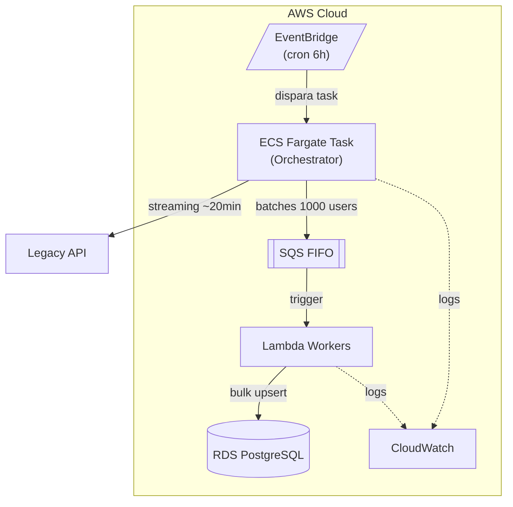

# Arquitetura AWS - User Sync Service

## Contexto

A API legada possui limitações que impactam diretamente a arquitetura:

| Característica | Valor        | Impacto                              |
| -------------- | ------------ | ------------------------------------ |
| Paginação      | Não suporta  | Streaming completo obrigatório       |
| Volume         | ~1M usuários | Streaming leva ~18-20 min            |
| Cursor/Offset  | Não suporta  | Não é possível retomar de onde parou |

**Implicação**: Lambda (timeout 15 min) não suporta o streaming completo. Necessário **ECS Task** para o orchestrator.

---

## Arquitetura: ECS Task + SQS + Lambda



<details>
<summary>Diagrama ASCII (fallback)</summary>

```
┌─────────────────────────────────────────────────────────────────┐
│                              AWS                                │
│                                                                 │
│  ┌──────────────┐       ┌────────────────────────────────────┐  │
│  │  EventBridge │──────▶│       ECS Fargate Task             │  │
│  │  (cron 6h)   │       │       (Orchestrator)               │  │
│  └──────────────┘       └──────────────┬─────────────────────┘  │
│                                        │                        │
│                                        ▼                        │
│                         ┌──────────────────────────────────┐    │
│                         │            SQS FIFO              │    │
│                         └──────────────┬───────────────────┘    │
│                                        │                        │
│                                        ▼                        │
│                         ┌──────────────────────────────────┐    │
│                         │        Lambda Workers            │    │
│                         └──────────────┬───────────────────┘    │
│                                        │                        │
│                                        ▼                        │
│                         ┌──────────────────────────────────┐    │
│                         │        RDS PostgreSQL            │    │
│                         └──────────────────────────────────┘    │
│                                                                 │
│  ┌──────────────┐                                               │
│  │  CloudWatch  │ ◀──────── Logs e métricas                     │
│  └──────────────┘                                               │
└─────────────────────────────────────────────────────────────────┘
```

</details>

---

## Componentes

| Componente          | Serviço AWS      | Justificativa                                            |
| ------------------- | ---------------- | -------------------------------------------------------- |
| **Orchestrator**    | ECS Fargate Task | Streaming de 18-20 min excede timeout do Lambda (15 min) |
| **Scheduler**       | EventBridge      | Cron nativo AWS                                          |
| **Fila**            | SQS FIFO         | Retry automático, DLQ                                    |
| **Workers**         | Lambda           | Escala automática, paga por execução                     |
| **Banco**           | RDS PostgreSQL   | Relacional, compatível com TypeORM                       |
| **Observabilidade** | CloudWatch       | Logs e métricas                                          |

---

## Perguntas do Teste

### 1. Como garantir execução periódica?

**EventBridge Scheduler** com regra `rate(6 hours)` dispara a ECS Task automaticamente.

### 2. Como tratar falhas e garantir retry?

| Camada       | Mecanismo                                            |
| ------------ | ---------------------------------------------------- |
| **ECS Task** | Retry policy com backoff exponencial                 |
| **SQS**      | Redelivery automático + DLQ para falhas persistentes |
| **Lambda**   | Retry automático em falhas transientes               |

### 3. Como escalar para grandes volumes?

- **Streaming**: ECS Task processa sequencialmente (limitação da API legada)
- **Processamento**: Lambda escala automaticamente com o tamanho da fila SQS

### 4. Qual estratégia para alta disponibilidade?

Todos os serviços escolhidos (ECS Fargate, SQS, Lambda, RDS) são gerenciados pela AWS e oferecem alta disponibilidade por padrão.

---

## Fluxo de Sincronização

1. EventBridge dispara ECS Task (a cada 6h ou via API)
2. ECS Task cria SyncLog com status RUNNING
3. Conecta na API legada via streaming
4. A cada 1000 usuários, envia mensagem para SQS
5. Lambda Workers consomem SQS em paralelo
6. Cada Lambda faz bulk upsert no RDS
7. ECS Task aguarda SQS esvaziar
8. Atualiza SyncLog para COMPLETED

---

## Mapeamento: Código Atual → AWS

| Componente Local        | Serviço AWS      |
| ----------------------- | ---------------- |
| BullMQ Queue            | SQS FIFO         |
| BullMQ Worker           | Lambda           |
| Redis                   | (removido)       |
| Cron (@Cron)            | EventBridge      |
| SQLite                  | RDS PostgreSQL   |
| NestJS (sync processor) | ECS Fargate Task |
